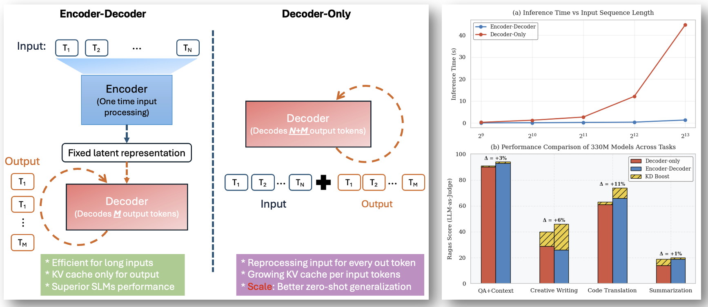

# Return of the Encoder: Efficient Small Language Models

📢 **Coming Soon**: Pretrained models will be available shortly!

## Overview
While large language models continue to grow in size, smaller models (≤1B parameters) require thoughtful architectural decisions. Our work demonstrates that encoder-decoder models inherently outperform decoder-only architectures before any optimizations:

- Base encoder-decoder achieves +2-4% performance improvement across tasks
- After knowledge distillation, performance gains increase to +6-8%
- Significantly more efficient than decoder-only counterparts:
 - 📉 47% lower first-token latency
 - 🚀 4.7x higher throughput on edge devices
 - 💾 11-16% less memory usage
 - ⚡ 22% fewer FLOPs for sequence generation

*Architectural Efficiency in SLMs. Left: Comparison of architectures where encoder-decoder creates a fixed input representation with KV cache only for output, while decoder-only requires growing KV caches for both input and output. Top right: Inference time scaling with input length, showing encoder-decoder's efficient fixed-representation approach versus decoder-only's steeper computational growth. Bottom right: Performance across tasks showing encoder-decoder's advantages at fixed compute budget, further enhanced by KD.*

## Technical Highlights
- **Efficient Base Architecture**: 2/3-1/3 encoder-decoder split consistently outperforms decoder-only
- **Enhanced Performance**: Knowledge distillation from larger teachers while maintaining architectural benefits
- **Hardware Efficiency**: Superior across GPU (86ms), CPU (1591ms), and NPU (189ms) platforms

## Performance
Our 330M parameter model outperforms decoder-only baselines (given same training data & FLOPs):
- SQuAD 2.0: 0.69/0.94 vs 0.57/0.90
- IELTS: 0.32/0.46 vs 0.31/0.40
- CodeXGLUE: 0.93/0.74 vs 0.93/0.63
- XSum: 0.27/0.20 vs 0.24/0.19
We also show that results continue as we scale the models up to 1B parameters.

⭐ Star this repository to get notified when we release the code and models!
